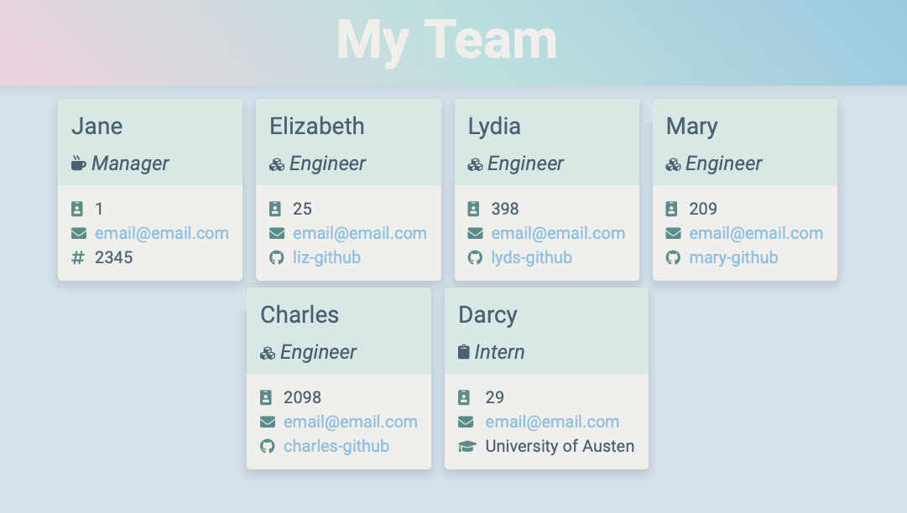
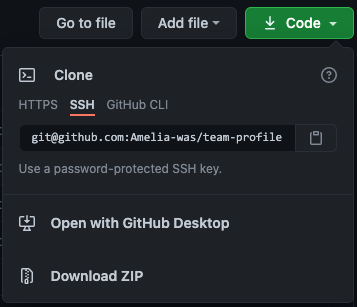

# Team Profile Generator &nbsp;&nbsp;&nbsp;

## Description

# Table of Contents
1. [Installation](#installation)
2. [Usage](#usage)
3. [Questions](#questions)
4. [Tests](#tests)
5. [License](#license)

## Installation
To use this app, you must have [node.js](https://nodejs.org/en/) installed. A basic knowledge of the command line is also required. See [here](https://datacarpentry.org/shell-genomics/02-the-filesystem/index.html) for help navigating directories in the command line.

1. To install the app, clone the respository above, or download as a .zip file.

2. In the command line, navigate to the directory containing the downloaded repsitory.
3. Download the inquirer package by typing the following in the command line:
`npm init`
4. Install inquirer by typing the following in the command line:
`npm install inquirer`

## Usage
1. In the root directory of the app, begin creating your team profile by entering `node index.js` in the command line.
2. Answer the prompts. You may add as many employees as you wish.
3. Once all the prompts have been answered, your team profile can be found in the '/dist' folder. You may navigate to it in the command line from the root directory of the app by entering:
`cd dist` 
`open my-team.html`

A video walkthrough of the app can be viewed [here](https://drive.google.com/file/d/1m37EWMxdWuJBLAVo5Sxwwz6Bf7nSjI_f/view?usp=sharing).

## Tests'
Tests were created using [Jest](https://jestjs.io). To run unit tests, navigate to the root directory of the app and enter `npm run test` in the command line.

## Questions
For additional questions, contact Amelia:

GitHub: [amelia-was](https://github.com/amelia-was)

## Built Using
- HTML
- CSS
- Spectre.css
- JavaScript
- Node.js
- Inquirer
- Jest.js

## License
Under the MIT license, this material is free to modify and distribute for commercial or private use. See [here](https://opensource.org/licenses/MIT) for more details.
